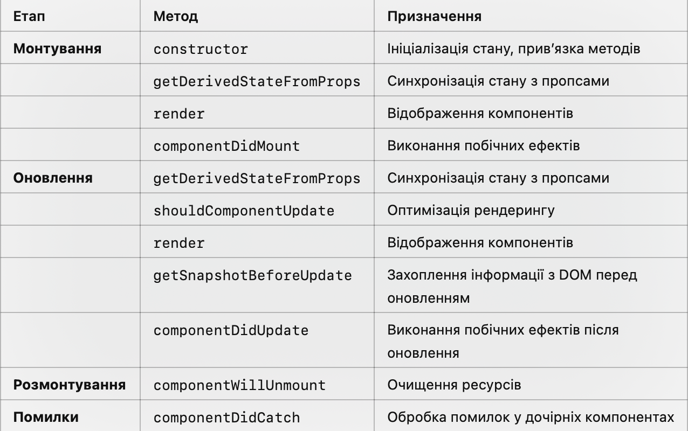

# Життєвий цикл компонента в React

Раніше ми вже згадували про життєвий цикл компонента, а тепер поговоримо про це детальніше.
**Життєвий цикл компонента** в React — це серія методів, які викликаються у певні моменти існування компонента. 
Розуміння життєвого циклу дозволяє ефективно управляти станом, обробляти події, запити до серверів та оптимізувати рендеринг компонентів.

## Основні етапи життєвого циклу компонента

Життєвий цикл компонента можна розділити на три основні етапи:
1.	**Монтування (Mounting)**: Компонент створюється та додається в DOM.
2.	**Оновлення (Updating)**: Компонент оновлюється у відповідь на зміни пропсів або стану.
3.	**Розмонтування (Unmounting)**: Компонент видаляється з DOM.


## Методи життєвого циклу у класових компонентах

У класових компонентах доступні спеціальні методи, що відповідають за певні етапи життєвого циклу.

### 1. Монтування (Mounting)

### 1.1. constructor(props)
•	Викликається під час створення компонента перед його вставленням у DOM.
•	Використовується для:
•	Ініціалізації стану через this.state.
•	Прив’язки методів до контексту this (для функцій, які передаються як обробники подій).
```js
constructor(props) {
  super(props); // Обов'язково викликати super(props)
  this.state = { count: 0 }; // Ініціалізація стану
  console.log('Constructor');
}
```
**Застереження:** 
Не виконуйте у constructor побічні ефекти, як-от запити до API. Використовуйте для цього componentDidMount.


### 1.2. static getDerivedStateFromProps(props, state)
•	Викликається до методу render як під час монтування, так і під час оновлення.
•	Використовується для синхронізації стану з пропсами.
•	Повертає новий об’єкт стану або null, якщо стан змінювати не потрібно.
```js
static getDerivedStateFromProps(props, state) {
  if (props.defaultCount !== state.count) {
    return { count: props.defaultCount }; // Оновлює стан
  }
  return null; // Стан залишається незмінним
}
```

### 1.3. render()
•	Єдиний обов’язковий метод у класовому компоненті.
•	Повертає JSX, який описує, що має бути відображено.
•	Має бути чистим: не змінювати стан, не виконувати побічних ефектів.
```js
render() {
  return <h1>Count: {this.state.count}</h1>;
}
```

### 1.4. componentDidMount()
•	Викликається один раз після вставлення компонента в DOM.
•	Використовується для:
•	Виконання побічних ефектів (запити до API, підписки, інтеграція з бібліотеками).
•	Ініціалізації таймерів.
```js
componentDidMount() {
  if(data) {
      this.setState({...data}) 
  }

  console.log('Component mounted');
  this.timerID = setInterval(() => {
    this.setState((prevState) => ({ count: prevState.count + 1 }));
  }, 1000);
}
```
**Застереження:** 
Не викликайте setState всередині componentDidMount без умови. Це може призвести до зайвого рендерингу.


### 2. Оновлення (Updating)

### 2.1. static getDerivedStateFromProps(props, state)
•	Викликається як під час монтування, так і під час оновлення. Докладніше описано вище.

### 2.2. shouldComponentUpdate(nextProps, nextState)
•	Викликається перед рендерингом, коли пропси або стан змінюються.
•	Використовується для оптимізації продуктивності: дозволяє запобігти непотрібному рендерингу.
•	Повертає true або false.
```js
shouldComponentUpdate(nextProps, nextState) {
  console.log('Should component update?');
  return nextState.count !== this.state.count; // Рендер лише при зміні count
}
```

### 2.3. render()
•	Метод render залишається незмінним.


### 2.4. getSnapshotBeforeUpdate(prevProps, prevState)
•	Викликається перед оновленням DOM.
•	Використовується для захоплення інформації з DOM (наприклад, позиції скролу) до його зміни.
•	Повертає значення, яке передається в componentDidUpdate.
```js
getSnapshotBeforeUpdate(prevProps, prevState) {
  if (prevState.count !== this.state.count) {
    return { timestamp: Date.now() }; // Захоплюємо час оновлення
  }
  return null;
}
```

### 2.5. componentDidUpdate(prevProps, prevState, snapshot)
•	Викликається після оновлення компонента.
•	Використовується для:
•	Виконання побічних ефектів, що залежать від оновлених пропсів або стану.
•	Взаємодії з DOM, яка залежить від результату рендерингу.
```js
componentDidUpdate(prevProps, prevState, snapshot) {
  if (snapshot) {
    console.log('Snapshot timestamp:', snapshot.timestamp);
  }
  if (prevState.count !== this.state.count) {
    console.log('Count was updated');
  }
}
```


### 3. Розмонтування (Unmounting)

### 3.1. componentWillUnmount()
•	Викликається перед видаленням компонента з DOM.
•	Використовується для:
•	Очищення ресурсів (таймерів, підписок, подій).
```js
componentWillUnmount() {
  console.log('Component will unmount');
  clearInterval(this.timerID); // Очищення таймера
}
```
**Порада:** Завжди очищуйте ресурси в цьому методі, щоб уникнути витоків пам’яті.


### 4. Додаткові методи життєвого циклу

### 4.1. componentDidCatch(error, info)
•	Використовується для обробки помилок у дочірніх компонентах.
•	Дозволяє створювати компоненти-запобіжники (Error Boundaries).
```js
componentDidCatch(error, info) {
  console.error('Error occurred:', error);
}
```

## Порівняльна таблиця методів життєвого циклу компонента:

