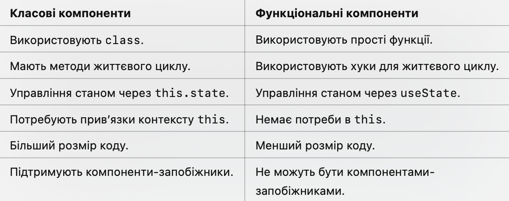

# Функціональні компоненти в React

Настав наш час поглиблюватися в сучасні стандарти розробки на React, і сьогодні ми поговоримо про функціональні компоненти.


**Функціональні компоненти в React** — це прості функції, які приймають пропси як аргумент і повертають React-елементи, 
описуючи, що саме має бути відображено у користувацькому інтерфейсі.

Особливості функціональних компонентів:
1.	Вони прості у написанні.
2.	До React 16.8 не підтримували стан (state) або методи життєвого циклу.
3.	З появою хуків функціональні компоненти можуть повністю замінити класові компоненти.
4.	Є рекомендованим способом написання компонентів у сучасному React.

## Синтаксис функціональних компонентів
Функціональний компонент — це JavaScript-функція, яка приймає об’єкт пропсів як аргумент і повертає JSX.

Простий приклад:
```js
function Greeting(props) {
  return <h1>Hello, {props.name}!</h1>;
}

// Використання компонента:
<Greeting name="Alice" />
```
**Особливості:**
•	props передаються у вигляді аргументу функції.
•	Компонент повинен повертати React-елемент (JSX).
•	Функція має бути чистою (не змінювати пропси чи глобальний стан).


## Функціональні компоненти з хуками
З появою **React Hooks** (з версії 16.8) функціональні компоненти отримали можливість управляти станом і використовувати методи життєвого циклу.
І зараз ми продовжимо тему функціональних компонетів, а про хуки поговоримо далі. Ви можете знайти інформацію по хукам в файлі:
> lesson-theory/4.react_hooks.md

> lesson-files/examples/src/components/Counter.jsx

## Додавання стану за допомогою useState
```js
import React, { useState } from 'react';

function Counter() {
  const [count, setCount] = useState(0); // Додавання стану

  const increment = () => setCount(count + 1);
  const decrement = () => setCount(count - 1);

  return (
    <div>
      <p>Count: {count}</p>
      <button onClick={increment}>+</button>
      <button onClick={decrement}>-</button>
    </div>
  );
}
```
**Як це працює:**
1.	useState повертає масив із двох елементів:
	•	Поточне значення стану.
	•	Функція для його оновлення.
2.	Початкове значення стану задається аргументом useState.


## Управління життєвим циклом за допомогою useEffect
Функція useEffect дозволяє виконувати побічні ефекти, такі як запити до API, підписки на події чи оновлення DOM.
> lesson-files/examples/src/components/Timer.jsx
```js
import React, { useState, useEffect } from 'react';

function Timer() {
  const [seconds, setSeconds] = useState(0);

  useEffect(() => {
    const interval = setInterval(() => {
      setSeconds((prevSeconds) => prevSeconds + 1);
    }, 1000);

    return () => clearInterval(interval); // Очищення інтервалу при розмонтуванні
  }, []); // Виконати тільки один раз після монтування

  return <p>Time: {seconds} seconds</p>;
}
```
**Особливості:**
•	useEffect виконується після кожного рендера, якщо не зазначено залежності.
•	Порожній масив залежностей ([]) означає, що ефект виконається лише один раз після монтування.
•	Функція, яка повертається з useEffect, виконується при розмонтуванні.


## Переваги функціональних компонентів
1.	Простота: Легко писати, читати та тестувати.
2.	Чистота коду: Вони є чистими функціями, які залежать тільки від своїх аргументів.
3.	Хуки: Завдяки хукам функціональні компоненти можуть мати повну функціональність, включаючи стан та методи життєвого циклу.
4.	Менший розмір коду: Не потрібно використовувати constructor, this чи прив’язувати методи.

## Недоліки функціональних компонентів
1.	Відсутність життєвого циклу до хуків: До React 16.8 функціональні компоненти не могли працювати зі станом і життєвим циклом.
2.	Оптимізація: Відсутність shouldComponentUpdate ускладнює ручну оптимізацію, але це вирішується через React.memo.


## Оптимізація функціональних компонентів

Використання React.memo. Зараз ми її розглянемо мимохідь і будемо поглиблюватися в наступних заняттях.
Функція React.memo запобігає повторному рендерингу функціонального компонента, якщо його пропси не змінилися.
> lesson-files/examples/src/components/Greeting.jsx
```js
import React from 'react';

const Greeting = React.memo(({ name }) => {
  console.log('Рендеринг');
  return <h1>Hello, {name}!</h1>;
});

// Використання
<Greeting name="Alice" />;
```

## Порівняння між класовими і функціональними компонентами


## Повний приклад функціонального компонента
> lesson-files/examples/src/components/CounterApp.jsx
```js
import React, { useState, useEffect } from 'react';

function CounterApp() {
  const [count, setCount] = useState(0);
  const [name, setName] = useState('');

  useEffect(() => {
    console.log(`Кількість змінена: ${count}`);
    return () => console.log('Очищення попереднього ефекту');
  }, [count]); // Виконується при зміні count

  return (
    <div>
      <h1>Hello, {name || 'Guest'}!</h1>
      <input
        type="text"
        placeholder="Enter your name"
        value={name}
        onChange={(e) => setName(e.target.value)}
      />
      <p>Count: {count}</p>
      <button onClick={() => setCount(count + 1)}>Increment</button>
      <button onClick={() => setCount(count - 1)}>Decrement</button>
    </div>
  );
}

export default CounterApp;
```

