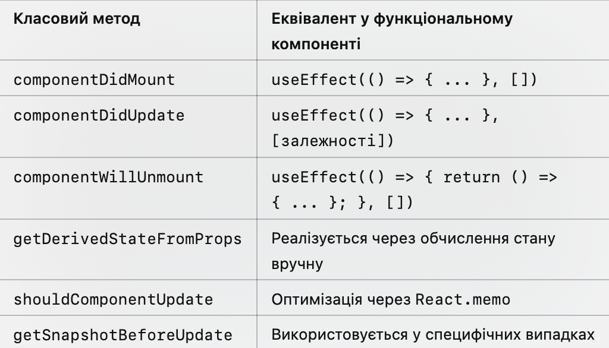

# Життєвий цикл у функціональних компонентах

Нарешті ми підійшли до завершення теми життєвого циклу компонентів і зараз поговоримо про життєвий цикл в 
функціональних компонентах більш детально.

Перше, що варто уточнити - це те, що функціональні компоненти в React **не мають методів життєвого циклу**, як класові компоненти. 
Проте з версії React 16.8 ми можемо реалізувати всі аспекти життєвого циклу за допомогою хуків, таких як useEffect і useState.

[3. functional_components.md](3.%20functional_components.md)## Основи роботи з useEffect
Хук useEffect дозволяє виконувати побічні ефекти в функціональних компонентах. 
Це еквівалентно багатьом методам життєвого циклу класових компонентів, залежно від того, як він використовується.
```js
useEffect(() => {
  // Побічний ефект
  return () => {
    // Очищення ефекту (опціонально)
  };
}, [залежності]);
```
1.	Перший параметр: функція, яка виконується як побічний ефект.
2.	Другий параметр: масив залежностей, який визначає, коли хук буде виконаний.


## Етапи життєвого циклу у функціональних компонентах

### 1. Монтування (Mounting)
Монтування в функціональному компоненті виконується через useEffect без зазначення залежностей.

Еквівалент componentDidMount:
```js
import React, { useEffect } from 'react';

function Component() {
  useEffect(() => {
    console.log('Компонент змонтовано');
    // Ідеальне місце для запиту до API
    fetchData();

    // Очищення не потрібне, тому немає return
  }, []); // Порожній масив залежностей означає, що ефект виконається лише один раз
}
```

### 2. Оновлення (Updating)
Оновлення відбувається, коли змінюється стан або пропси. У функціональних компонентах це контролюється через залежності в useEffect.

Еквівалент componentDidUpdate:
```js
import React, { useEffect, useState } from 'react';

function Component({ prop }) {
  const [state, setState] = useState(0);

  useEffect(() => {
    console.log('Компонент оновлено');
    // Цей код виконається кожного разу, коли змінюється state або prop
  }, [state, prop]); // Ефект залежить від state і prop

  return <button onClick={() => setState(state + 1)}>Click me</button>;
}
```

### 3. Розмонтування (Unmounting)
Розмонтування у функціональному компоненті відбувається, коли ми повертаємо функцію очищення в useEffect.

Еквівалент componentWillUnmount:
```js
import React, { useEffect } from 'react';

function Component() {
  useEffect(() => {
    const timer = setInterval(() => {
      console.log('Таймер працює');
    }, 1000);

    // Очищення таймера при розмонтуванні
    return () => {
      console.log('Компонент буде розмонтовано');
      clearInterval(timer);
    };
  }, []); // Очищення виконається, коли компонент буде розмонтовано

  return <div>Компонент з таймером</div>;
}
```


## Деталі використання useEffect

Залежності в useEffect:
•	Масив залежностей визначає, коли саме буде викликано ефект.
•	Без масиву: Ефект виконується після кожного рендера (не рекомендується для більшості випадків).
•	Порожній масив: Ефект виконується лише один раз (еквівалентно componentDidMount).
•	Масив із залежностями: Ефект виконується лише тоді, коли змінюються зазначені залежності.
```js
useEffect(() => {
  console.log('Цей ефект залежить від state');
}, [state]); // Ефект виконається тільки при зміні state
```

### Очищення ефектів
Очищення потрібне для видалення таймерів, відписки від подій або очищення ресурсів.
```js
useEffect(() => {
  const handleResize = () => {
    console.log('Зміна розміру вікна');
  };

  window.addEventListener('resize', handleResize);

  return () => {
    console.log('Очищення слухача подій');
    window.removeEventListener('resize', handleResize);
  };
}, []); // Очищення при розмонтуванні
```


## Порівняльна таблиця життєвого циклу в класових і функціональних компонентах


## Повний життєвий цикл у функціональному компоненті
А ось так буде виглядати повний приклад функціонального компоненту з повним життєвим циклом

>lesson-files/functional_component_lifecycle/src/components/LifecycleDemo.jsx

```js
import React, { useState, useEffect } from 'react';

function LifecycleDemo({ prop }) {
  const [state, setState] = useState(0);

  // Монтування
  useEffect(() => {
    console.log('Компонент змонтовано');

    return () => {
      console.log('Компонент розмонтовано');
    };
  }, []);

  // Оновлення
  useEffect(() => {
    console.log('Стан або пропси змінилися');

    return () => {
      console.log('Очищення після оновлення');
    };
  }, [state, prop]);

  return (
    <div>
      <p>State: {state}</p>
      <button onClick={() => setState(state + 1)}>Змінити стан</button>
    </div>
  );
}

export default LifecycleDemo;
```